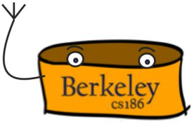

# cs-186-2022
Version Based on Fall-2022 + Addtional Contents on Spring 2023

**Topics Including:**

1. Internal Structure of RDBMS (Disk Manager, Buffer Manager, File and Index Manger, Query Optimization, SQL Cliend)
2. B+ tree Implementation
3. Sort and Hash
4. Join Algorithm (Naive Hash, Grace Hash, Sort-Merge)
5. Relational Algebra
6. Query Optimization
7. Cocurrency Control and Locking Manager (2-PL)
8. Recovery Control and Log Manager
9. Parallel Querying
10. Distributed Transaction and 2 Phase Commit
11. NoSQL and MongoDB
12. Spark and MapReduce
